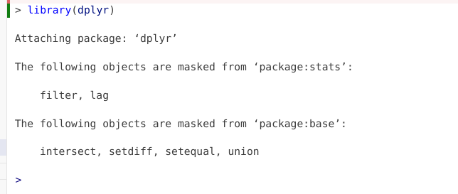
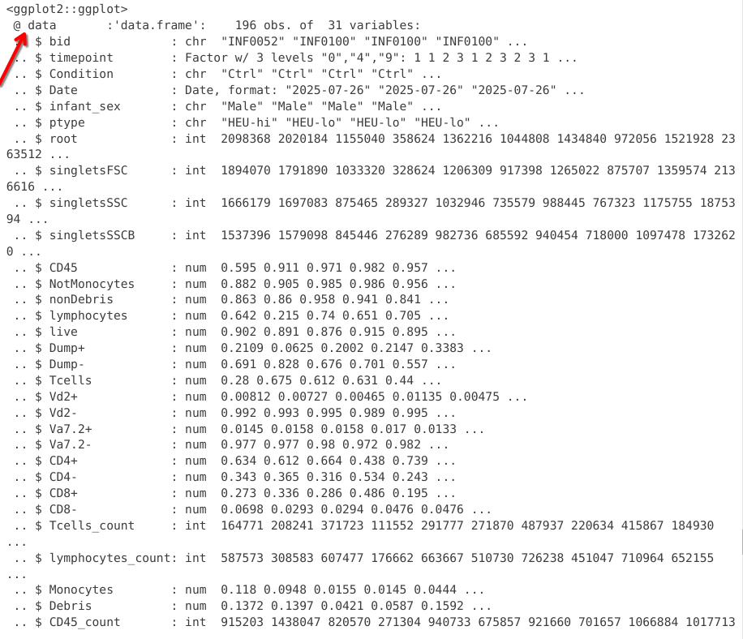
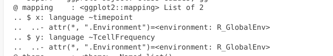

::: {style="text-align: right;"}
[](https://www.gnu.org/licenses/agpl-3.0.en.html) [](http://creativecommons.org/licenses/by-sa/4.0/)
:::

For the YouTube livestream schedule, see [here](https://www.youtube.com/@cytometryinr)

For screen-shot slides, click [here]()

<br>

---

# Background

Welcome back! This is the sixth week of Cytometry in R. At this point we are slowly but surely building a solid foundation of general R knowledge, and learning how to apply it when it comes to working with cytometry data. This week, we will explore how to use the `ggplot2` package to create plots. While these will include plots typical of cytometry, `ggplot2` and its extension packages can be used to create quite a few visualizations, from statistics, to maps, to graphics for news articles. 

# Walk Through

:::{.callout-important title="Housekeeping"}
As we do [every week](/course/02_FilePaths/index.qmd), on GitHub, [sync](/course/00_Homeworks/index.qmd#sync-your-fork) your forked version of the CytometryInR course to bring in the most recent updates. Then within Positron, [pull](/course/00_Homeworks/index.qmd#pull-to-local) in those changes to your local computer. 

After [setting up](/course/00_Git/index.qmd#new-folder-from-template) a "Week06" project folder, copy over the contents of "course/06_Visualizing/data" to that folder. This will hopefully prevent merge issues next week when attempting to pull in new course material. Once you have your new project folder organized, remember to [commit](/course/00_Git/index.qmd#push) and push your changes to GitHub to maintain remote version control. 

If you encounter issues syncing due to the Take-Home Problem merge conflict, see this [walkthrough](https://umgcccfcsr.github.io/CytometryInR/course/00_BonusContent/PullConflicts/). The updated homework submission protocol can be found [here](https://umgcccfcsr.github.io/CytometryInR/course/00_BonusContent/PullConflicts/UpdatedPullRequest)
:::

## Preparation

### Masked Function Names

Since we will be using `dplyr` extensively throughout this session, let's go ahead and attach it to our local environment via the `library()` function. 

```{r}
library(dplyr)
```

If `dplyr` was not already attached to your local environment, you might have gotten the following message



The reason behind this message is that both the `dplyr` and `stats` packages contain functions named "filter" and "lag". Since `stats` is a base R package that is loaded by default, when `dplyr` is loaded via the `library()` call, both packages functions become active in your environment. Consequently, if you ran a line of code containing "filter" or "lag", R would not know which packages function you intender to use in that line of code.

To avoid this, the base R `stats` and `base` package functions with identical names are masked (ie. hidden), so that the `dplyr` functions are instead prioritized when code is run. 

### Load Dataset

Lets continue by loading in the dataset we were working with during [Week # 4](/course/04_IntroToTidyverse/). 

```{r}
#StorageLocation <- file.path("course", "06_Visualizing", "data") # When interactively writing the code 
StorageLocation <- file.path("data") #When Quarto Rendering

TheCSV <- list.files(StorageLocation, pattern=".csv", full.names=TRUE)
Data <- read.csv(TheCSV, check.names=FALSE)

head(Data, 3)
```

### Identifying column value types

And let's quickly evaluate the columns to determine what type of values each contains

```{r}
str(Data)
```

The type of values that a column contains are particularly important to be aware of when working with `ggplot2` plots. For example, we can see that several columns contain character values:

```{r}
Data |> select(bid, Condition, Date, infant_sex, ptype) |> head(6) |> str()
```

While spotting the character columns from the `str()` output, and isolating them using `select()` works, we could achieve something similar using the `is.character()` function in combination with the `where()` function, which the `dplyr` package actively borrows (ie. exports) from the `tidyselect` package. 

```{r}
Data |> select(where(is.character)) |> head(6) |> str()
```

We can switch out `is.character()` to identify columns containing other value types

```{r}
Data |> select(where(is.numeric)) |> head(6) |> str()
```

```{r}
Data |> select(where(is.logical)) |> head(6) |> str()
```

### Reformatting Column Value Types

Looking at the `str()` output, we can spot that the Date column is currently showing as a character value:

```{r}
Data |> select(Date) |> str()
```

Character values when plotting are generally treated as categorical factors. When plotted, these will arrange according to alphabetical order. In this particular case, this may not be an issue:

```{r}
Data |> pull(Date) |> sort() |> unique() 
```

However, if year/month/day is formatted differently, as character values, the alphabetical reordering could result in your dates being scrambled

```{r}
AlternateFormat <- c("26-07-2025", "27-08-2019", "09-09-2025", "16-03-2026")
AlternateFormat |> sort() |> unique()
```

Because of this, I generally recommend reformatting these character type values over to Date type values. I will generally use the the tidyverse `lubridate` package, as it has various functions that can handle the date format variation. In this case, since the character values appear year-month-day, we can use the `ymd()` function to update the column type

```{r}
library(lubridate)
```

```{r}
Data$Date <- ymd(Data$Date)
str(Data[,1:5])
```

You can notice, `str()` now returns the column type as "Date". 

### Factors

For columns with numeric type values, we previously discussed the difference between integer (ie. whole) and double (containing decimal point) values. When it comes to plotting using ggplot, numeric values will generally be treated as [continuous](https://www.r-bloggers.com/2022/01/handling-categorical-data-in-r-part-1/) values unless we specify they should be treated as [categorical](https://www.r-bloggers.com/2022/01/handling-categorical-data-in-r-part-1/) values for plotting. 

For example, if we look at the Timepoint column, we can see its numeric values are [discrete](https://www.r-bloggers.com/2022/01/handling-categorical-data-in-r-part-1/), corresponding to the timepoint in months when the blood sample was collected (0, 4, 9)

```{r}
Data |> pull(timepoint) |> unique()
```

If we want to avoid having `ggplot` treating these values as continuous, and instead see them as categorical, we will need to specify to R to treat these as such. We can do this by converting them into [factos](https://r4ds.had.co.nz/factors.html), using the `factor()` function. 

```{r}
Data1 <- Data
Data1$timepoint <- factor(Data1$timepoint)
str(Data1[,1:3])
```

We will see what occurs when we try to plot without having specified this numeric column as a categorical factor later today, but mentioning it early, as creating factor variables is something we will see continously throughout the class when it comes to both plotting and statistical analysis. 

## ggplot2

Alright, with the data imported, havinf refreshed our memory of the types of values contained within, we are now ready to start learning how to ready top lot in R using the `ggplot2` package. For this first plot, as we learn more about the [grammar of graphics](https://ggplot2-book.org/mastery.html) concept, and how to layer the different arguments together, lets first decide what kind of plot we want to build. 

Glancing at Data, let's try creating a boxplot, with the different timepoints on the x-axis, and the frequency of T cells in the CD45+ gate on the y-axis. We can envision we want something at the end that resembles the following:

Let's go ahead and actually convert timepoint over to a categorical factor for this example, and mutate the frequency column. 

```{r}
Data <- Data |> 
    mutate(TcellProportion=Tcells_count/CD45_count) |>
    mutate(TcellFrequency=TcellProportion *100) |>
    mutate(TcellFrequency=round(TcellFrequency, 1))

Data$timepoint <- factor(Data$timepoint)
```

Lets start by going ahead and calling `library()` for ggplot2

```{r}
library(ggplot2)
```

### Data

```{r}
Plot <- ggplot(Data)
Plot
```

As you can see, nothing is yet outputted at this stage. Let's however peak behind the curtain. 

```{r}
#| eval: FALSE
str(Plot)
```

In this first chunk, we see that the data slot of the ggplot object now contains the underlying data.frame object



If we scroll past, we can spot additional slots, which are currently empty, waiting to be filled. We will sporadically check back and see how this changes. 


### Aesthetics

Having established the first layer of our plot (Data), we can now start by specifying the next layer, aesthetics. In our case, we were interested in placing timepoint on the x-axis, and placing the TcellFrequency on the y-axis. 

```{r}
Plot <- ggplot(Data) + aes(x=timepoint, y=TcellFrequency)
Plot
```

As you can see, additional elements were added to the plot, namely we are now seeing on the axis we specified. 

If we glanced behind the curtains, we now see the mapping slot has now been filled in

```{r}
#| eval: FALSE

str(Plot)
```



In our case, we are building this plot with each layer being connected by a "+"" argument. However, you will often see both the Data and Aesthetics layers combined together in actual practice. This would look like the following

```{r}
ggplot(Data, aes(x=timepoint, y=TcellFrequency))
```

#### No Quotation Marks!

You may have noticed, we relied on tidyverse to figure out that timepoint and TcellFrequency were column names, and not objects in our environment (for reasons detailed during [Week 04]()). What would have happened if we had included "" around each?

```{r}
ggplot(Data) + aes(x="timepoint", y="TcellFrequency")
```

Yikes! Not what we were expecting. 

### Geometries

Having specified our Data and Aesthetics layers, we now reach the important point in our plotting step, deciding on what geometries we want to use. It is this layer that determines how the data actually gets plotted. 

For example, we could use the `geom_point()` function to set the plot geometry as follows

```{r}
ggplot(Data) + aes(x=timepoint, y=TcellFrequency) + geom_point()
```

We could swap `geom_point()` out for `geom_boxplot()`

```{r}
ggplot(Data) + aes(x=timepoint, y=TcellFrequency) + geom_boxplot()
```

or `geom_violin()`

```{r}
ggplot(Data) + aes(x=timepoint, y=TcellFrequency) + geom_violin()
```

We could also add two geometries

```{r}
ggplot(Data) + aes(x=timepoint, y=TcellFrequency) + geom_boxplot() + geom_point()
```

As you can see, many different `geom_` functions exist in both ggplot2, as well as other R packages that expand the plotting capacity further. One I like to use for my own plots is the `ggbeeswarm` package, specifically the `geom_beeswarm()` function in conjunction with the `geom_boxplots()`. 

```{r}
library(ggbeeswarm)
Plot <- ggplot(Data) + aes(x=timepoint, y=TcellFrequency) + geom_boxplot() + geom_beeswarm()
Plot
```

We will continue building offf this plot version as we go forward. 

#### If left as continuous

In the case of the above dataset, we had converted timepoint to a factor. But what would our plot have looked like if we had left it in the original continuous format?

```{r}
AlternateData <- read.csv(TheCSV, check.names=FALSE)
AlternateData <- AlternateData |> 
    mutate(TcellProportion=Tcells_count/CD45_count) |>
    mutate(TcellFrequency=TcellProportion *100) |>
    mutate(TcellFrequency=round(TcellFrequency, 1))
ggplot(AlternateData) + aes(x=timepoint, y=TcellFrequency) + geom_beeswarm()
```

As you can see, in this case, the x-axis instead of being spaced categorically, now appears as continuous, with the individual dots being plotted at 0, 4, 9 respectively. 

Given that `geom_boxplot` is expecting a categorical factor, this fails to plot correctly when added on

```{r}
ggplot(AlternateData) + aes(x=timepoint, y=TcellFrequency) + geom_boxplot() + geom_beeswarm()
```

Fortunately, the warning message provides some context we can use when troubleshooting. If we implement the suggestion, we are able to rescue `geom_boxplot()` plotting attempt even in abscence of specifying timepoint as categorical.

```{r}
ggplot(AlternateData) + aes(x=timepoint, y=TcellFrequency, group=timepoint) + geom_boxplot() + geom_beeswarm()
```

This example generally highlights the importance of being aware of what types of values you are trying to plot, warning messages, and some of the quiky odd-looking plots that can arise when the assumptions are not met. 

#### Mismatched Assumptions

In this case, the two "geom_" functions we are using are using x-axis value as categorical, and y-axis as a continuous variable. What happens if we used a "geom_" function that has different specifications?

```{r}
#| error: TRUE
ggplot(Data) + aes(x=timepoint, y=TcellFrequency) + geom_histogram() 
```

In the case of the above, `geom_histogram()` was expecting only one column being present in the `aes()` argument. 

```{r}
ggplot(Data) + aes(x=TcellFrequency) + geom_histogram() 
```

This would similarly be the case for `geom_density()`
```{r}
ggplot(Data) + aes(x=TcellFrequency) + geom_density() 
```

### Facets

At this point, we have added the Data, Aesthetic, and two Geometry layers. We have a decent working version of our plot object which we can continue to edit as we go forward. 

```{r}
Plot <- ggplot(Data) + aes(x=timepoint, y=TcellFrequency) + geom_boxplot() + geom_beeswarm()
Plot
```

The next layer, Facets, allows creation of separate plots based on an additional variable. For example, if we were interested in seeing the difference between male and female infrants, we could specify the column name within the `facet_wrap()` argument. 

```{r}
ggplot(Data) + aes(x=timepoint, y=TcellFrequency) + geom_boxplot() + geom_beeswarm() + facet_wrap(~ infant_sex)
```

We could similarly return individual plots for various treatment conditions (Ctrl, PPD, SEB)

```{r}
ggplot(Data) + aes(x=timepoint, y=TcellFrequency) + geom_boxplot() + geom_beeswarm() + facet_wrap(~ Condition)
```

We could also use the variant `facet_grid()` to facet on the basis of two separate variables. 

```{r}
ggplot(Data) + aes(x=timepoint, y=TcellFrequency) + geom_boxplot() + geom_beeswarm() + facet_grid(infant_sex ~ Condition)
```

### Statistics

### Coordinates

```{r}
ggplot(Data) + aes(x=timepoint, y=TcellFrequency) + geom_boxplot() + geom_beeswarm()
```

```{r}
ggplot(Data) + aes(x=timepoint, y=TcellFrequency) + geom_boxplot() + geom_beeswarm() + coord_cartesian(ylim=c(0, 100))
```

### Themes

#### Broad Themes

```{r}
ggplot(Data) + aes(x=timepoint, y=TcellFrequency) + geom_boxplot() + geom_beeswarm() + theme_classic()
```

```{r}
ggplot(Data) + aes(x=timepoint, y=TcellFrequency) + geom_boxplot() + geom_beeswarm() + theme_bw()
```

```{r}
ggplot(Data) + aes(x=timepoint, y=TcellFrequency) + geom_boxplot() + geom_beeswarm() + theme_minimal()
```

#### Active Customization

Instead of applying broad theme, you can also modify individual elements. For example, we can 

```{r}
ggplot(Data) + aes(x=timepoint, y=TcellFrequency) + geom_boxplot() + geom_beeswarm() +
theme(
    panel.grid.major = element_blank())
```

```{r}
ggplot(Data) + aes(x=timepoint, y=TcellFrequency) + geom_boxplot() + geom_beeswarm() +
theme(
    panel.grid.major = element_blank(),
    panel.grid.minor = element_blank())
```

Especially useful in cases with long axis text names, we can rotate them using the "angle" argument (and horizontally justify their starting position using "hjust")

```{r}
ggplot(Data) + aes(x=timepoint, y=TcellFrequency) + geom_boxplot() + geom_beeswarm() +
theme(
    panel.grid.major = element_blank(),
    panel.grid.minor = element_blank(),
    axis.text.x = element_text(angle=45, hjust=1, size = 16))
```

```{r}
ggplot(Data) + aes(x=timepoint, y=TcellFrequency) + geom_boxplot() + geom_beeswarm() +
theme(
    panel.grid.major = element_blank(),
    panel.grid.minor = element_blank(),
    axis.text.x = element_text(angle=45, hjust=1, size = 12),
    axis.text.y = element_text(size=12))
```

## ggcyto

Let's return to the [initial](/course/05_GatingSets/index.qmd#plotting) flow cytometry style plots we generated last time using `ggcyto`, and see if we can customize them further using what we have learned today. 

As we mentioned during [Week 5](/course/05_GatingSets/index.qmd#ggcyto), `ggplot2` implemented some major changes going from version 3 to 4. As a result of this, ggcyto had to implement several [bug fixes](https://github.com/RGLab/ggcyto/pull/110) to get the developmental branch back to working order. Consequently, as of the time of this course, you need the following versions (or greater) or both packages to successfully create all the plots. 

```{r}
packageVersion("ggplot2")
packageVersion("ggcyto")
```

If you are still running older versions, and encounter issues, the updating your package version instructions are [here](/course/05_GatingSets/index.qmd#packageversion)

Let's begin by loading in the additional R packages we will need

```{r}
library(CytoML)
library(ggcyto)
```

And proceed to load in the FlowJo.wsp [example](/course/05_GatingSets/index.qmd#cytoml) from Week 05 into a GatingSet object.

```{r}
# StorageLocation # Defined Above
FlowJoWsp <- list.files(path = StorageLocation, pattern = ".wsp", full = TRUE)
ws <- open_flowjo_xml(FlowJoWsp)
gs <- flowjo_to_gatingset(ws=ws, name=1, path = StorageLocation, additional.keys = "GROUPNAME")
```

And return to the plot we had left off on:

```{r}
Plot <- ggcyto(gs[6], subset="Tcells", aes(x="CD8", y="CD4")) + geom_hex(bins=100)
```

To start, let's switch out the background theme. 

```{r}
Plot + theme_bw()
```

# Take Away

In this session, we saw how using grammar of graphics concept, we can create ggplot2 plots by adding on individual layers, which can permit us to build different style of plots depending on what we want to visualize. 

Next time, we will take a closer look at how to modify `ggcyto` plots in other to visualize differences when different transformations (scaling) is applied, as well as compensation in the context of conventional flow cytometry files.


# Additional Resources

[ggplot2: Elegant Graphics for Data Analysis](https://ggplot2-book.org/mastery.html) A book written by Hadley Wickham, Danielle Navarro, and Thomas Lin Pedersen, who are the main developers. It is an excellent resource for both beginners and advanced users alike. 

[Introduction to {ggplot2} in R by Tanya Shapiro | R-Ladies Paris]() There are [many](https://rladies.org/) R-Ladies groups worldwide hosting monthly meetups. Many of them post their monthly workshops on YouTube, which are an invaluable resource for those just getting started. 

[Level up your Plots with Cara Thompson](https://youtu.be/_indbXPXUw8?si=7BUdWGmPOfG5fDaZ) I really enjoy Cara Thompson's videos, if you want to dive deeply into how to make your ggplots go above and beyond, look up her resource videos on YouTube. 

[Tidy Tuesday](https://github.com/rfordatascience/tidytuesday) Make sure to star and follow the hashtag for weekly inspiration! 

# Take-home Problems

:::{.callout-tip title="Problem 1"}
Work in Progress
:::

:::{.callout-tip title="Problem 2"}
Work in Progress
:::

:::{.callout-tip title="Problem 3"}
Work in Progress
:::

::: {style="text-align: right;"}
[](https://www.gnu.org/licenses/agpl-3.0.en.html) [](http://creativecommons.org/licenses/by-sa/4.0/)
:::